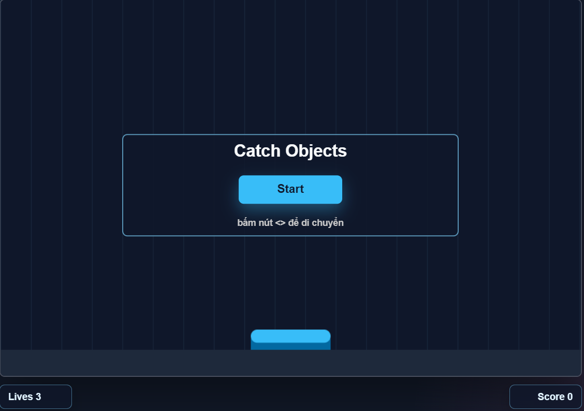

# 🎮 Catch The Falling Object Game

A simple HTML5 Canvas game where players control a catcher to collect valuable items while avoiding dangerous obstacles.

## 🚀 Play Now

👉 **https://tunaanhgamedev.github.io/Hoc_js/hoc_js/purus/week_1_2DContext/catching_object_game/**



## 📖 Description

In this game, objects continuously fall from the top of the screen.

The player controls a catcher at the bottom of the screen and must:

* 🟡 Collect Coins to earn points
* ❤️ Collect Hearts to gain extra lives
* 💣 Avoid Bombs or lose immediately
* 🚧 Avoid Obstacles or lose a life

The game gradually becomes more challenging as falling speed and player movement speed increase over time.

## 🎯 Gameplay Rules

| Object      | Effect    |
| ----------- | --------- |
| 🟡 Coin     | +1 Score  |
| ❤️ Heart    | +1 Life   |
| 💣 Bomb     | Game Over |
| 🚧 Obstacle | -1 Life   |

Missing Coins, Hearts, or Bombs does not cause any penalty.

## 🛠 Technologies

* HTML5 Canvas
* JavaScript (ES6)
* Object-Oriented Programming (OOP)
* Game Loop
* Collision Detection

## 📂 Project Structure

```text
catching_object_game/
├── img/
├── catcher.js
├── falling_object.js
├── game.js
├── game_object.js
├── game_ui.js
├── obstacle.js
├── style.css
└── index.html
```

## 🚀 Features

* Smooth animation using requestAnimationFrame
* Collision detection system
* Score system
* Life system
* Multiple object types
* Progressive difficulty

## 📸 Screenshot

Add screenshots here.

## 👨‍💻 Author

Anh Tuấn

GitHub:
https://github.com/Tunaanhgamedev

